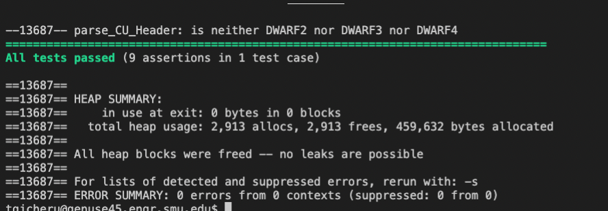

# Assignment 3: Answers

**Complete this document, commit your changes to Github and submit the repository URL to Canvas.** Keep your answers short and precise.

Your Name: Trevor Gicheru

Used free extension: [ ] 24 hrs or [X] 48 hrs

[ ] Early submission (48 hrs)

[ ] Bonus work. Describe: ...

Place [x] for what applies.

## Answers
1. How long did the program take with each version (You will need more than the test data)?  Describe what differences in run time you expect for your implementation. What you see in your experiments?

 Here are results for three trials:
 DS List: 8.3e-08 milliseconds, 4.1e-08 milliseconds, 8.3e-08 milliseconds
 Array: 4.1e-08 milliseconds, 8.4e-08 milliseconds, 4.1e-08 milliseconds

 The times contantly varied not signiticantly but enough to take notice

2. Discuss the difference in memory usage based on your implementation. You will need to think about how the versions store data.

The main difference in memory usage between DSStack_List and DSStack_Array is that DSStack_List uses a linked list to store data while DSStack_Array uses an array.

In DSStack_List, each node in the linked list contains a pointer to the next node and the data value. This means that each node requires additional memory to store the pointer. However, this also means that the stack can grow dynamically as needed and can handle large amounts of data.

In DSStack_Array, the stack is implemented as an array of fixed size. This means that the stack cannot grow beyond its initial size and may not be able to handle large amounts of data. However, since there are no pointers involved, the memory usage is generally lower than that of DSStack_List.

3. Which version would you use in practice. Why?

I would use array in my situation because it is faster.

4. Make sure that your stack implementation does not have memory leaks.

   
   Paste the output of valgrind or the AddressSanitizer to for running your tests for DSList and DSStack to show that your code is fine. 

   

   
  

5. Did you attempt any bonuses? If so, please give a brief description of what you did.

  N/a
